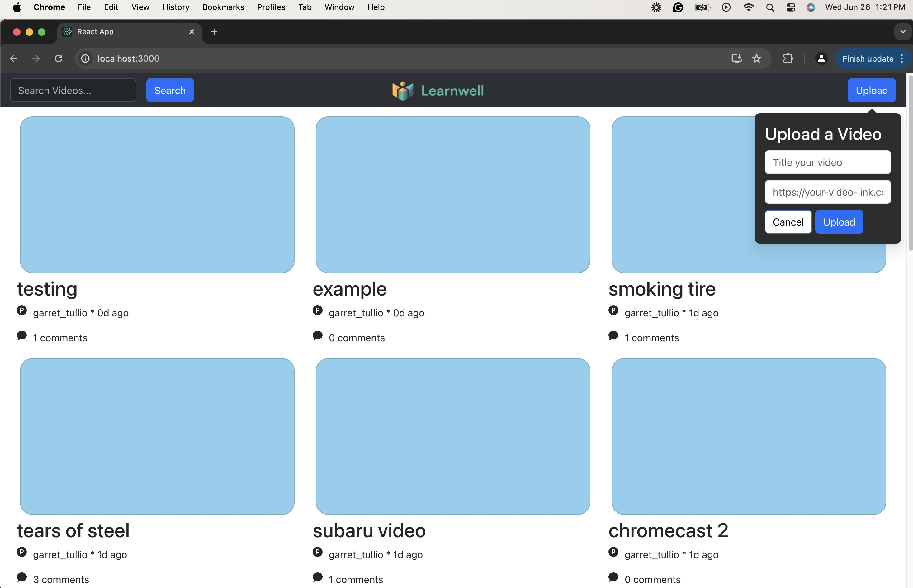
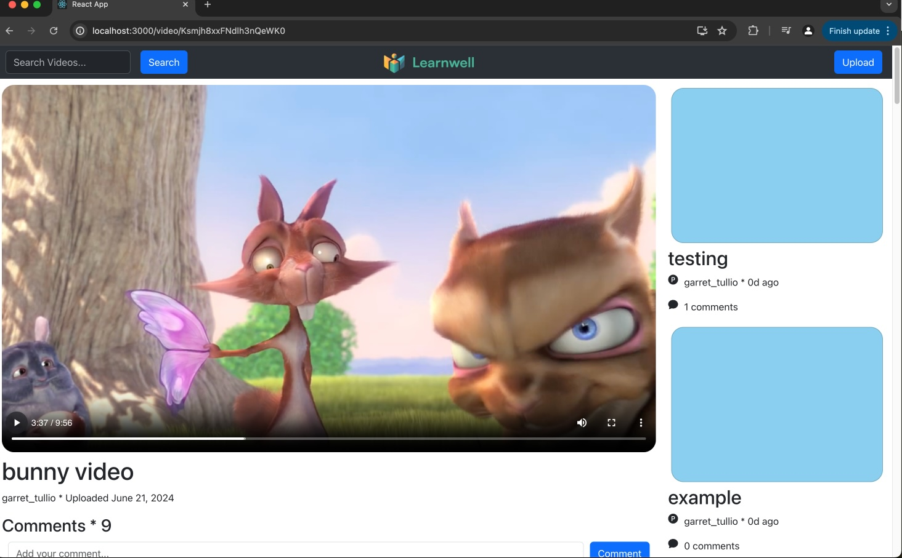
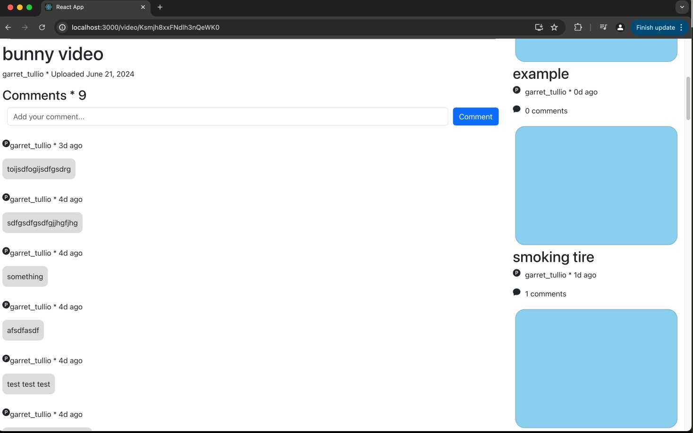
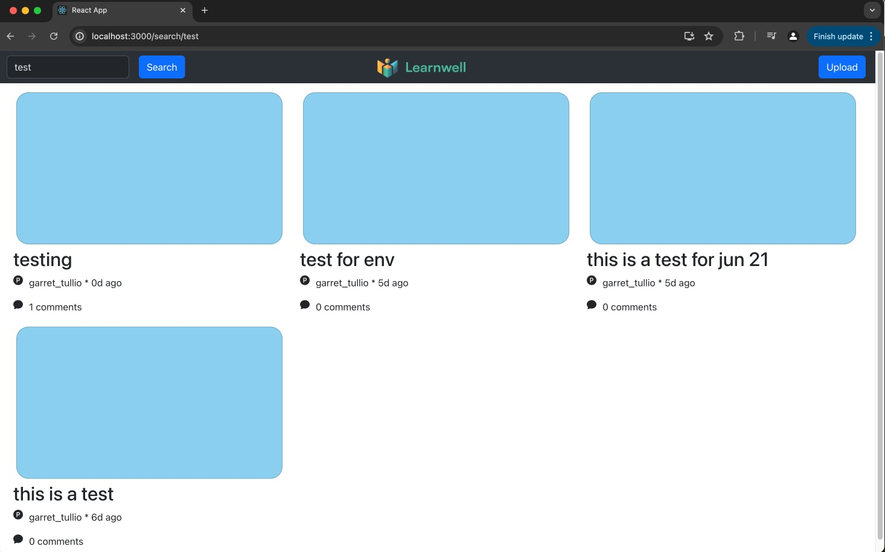

# Education Video Player

## Solution
Basic video player with sample videos. The website has three main pages, the `Home` component, `SearchVideos` component and the `View`(which displays the video selected from either `Home` or `SearchVideos`). The user garret_tullio is hardcoded into the frontend. For the search page, the search will show any videos based off of title of video, as long as the search content is a substring of the video title it will show up on the search page.  \
The sample videos were taken from [here](https://gist.github.com/deepakpk009/99fd994da714996b296f11c3c371d5ee)

## Instructions on how to build and run the application on the web.
Go to root directory and run \
`npm install` \
`npm run build` \
`npm start` \
Go to `localhost:3000` 

In order to upload a video navigate to this [page](https://gist.github.com/deepakpk009/99fd994da714996b296f11c3c371d5ee) and copy one of the mp4 file links, give the video a title and press submit. 

## Screenshots of the platform.

